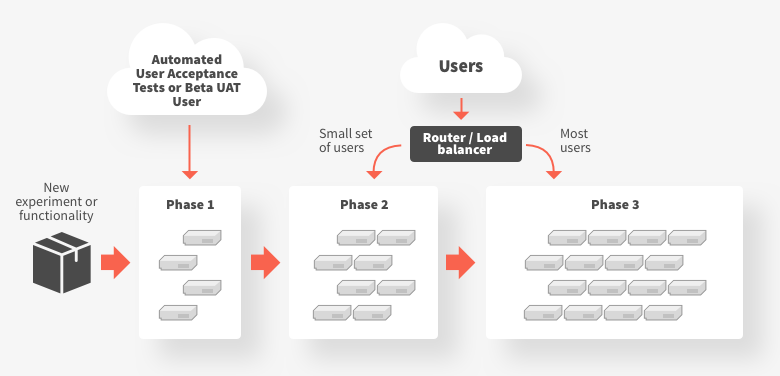

Today's cloud-native applications may consist of hundreds of services, each of which are being updated at any time. Thus, many cloud-native organizations augment regression test strategies with testing in production using progressive delivery techniques.

Progressive Delivery is an approach for releasing software to production users. In the progressive delivery model, software is released to ever growing subsets of production users. This approach reduces the blast radius in the event of a failure.

## Why test in production?

Modern cloud applications are continuously deployed, as different teams rapidly update their respective services. Deploying and testing updates in a pre-production staging environment introduces a bottleneck to the speed of iteration. More importantly, staging environments are not representative of what will be running in production when the deployment actually occurs given the velocity of service updates and changes in production. Testing in production addresses both of these challenges: developers evaluate their changes in the real-world environment, enabling rapid iteration.

## Progressive delivery strategies

There are a number of different strategies for progressive delivery. These include:

* Feature flags, where specific features are made available to specific user groups
* Canary releases, where a (small) percentage of traffic is routed to a new version of a service before the service is full production
* Traffic shadowing, where real user traffic is copied, or shadowed, from production to the service under test

Observability is a critical requirement for testing in production. Regardless of progressive delivery strategy, collecting key metrics around latency, traffic, errors, and saturation (the [“Four Golden Signals of Monitoring”](https://landing.google.com/sre/sre-book/chapters/monitoring-distributed-systems/#xref_monitoring_golden-signals)) provides valuable insight into the stability and performance of a new version of the service. Moreover, application developers can compare the metrics (e.g., latency) between the production version and an updated version. If the metrics are similar, then updates can proceed with much greater confidence.

Emissary-ingress supports a variety of strategies for progressive delivery. These strategies are discussed in further detail below.

### Canary releases

Canary releases shifts a small amount of real user traffic from production to the service under test.

The user will see the direct response from the canary version of the service from any traffic that is shifted to the canary release, and they will not trigger or see the response from the current production released version of the service. The canary results can also be verified (both the downstream response and associated upstream side effects), but it is key to understand that any side effects will be persisted.

In addition to allowing verification that the service is not crashing or otherwise behaving badly from an operational perspective when dealing with real user traffic and behavior, canary releasing allows user validation. For example, if a business KPI performs worse for all canaried requests, then this most likely indicates that the canaried service should not be fully released in its current form.

Canary tests can be automated, and are typically run after testing in a pre-production environment has been completed. The canary release is only visible to a fraction of actual users, and any bugs or negative changes can be reversed quickly by either routing traffic away from the canary or by rolling-back the canary deployment.

Canary releases are not a panacea. In particular, many services may not receive sufficient traffic in order for canary releases to provide useful information in an actionable timeframe.

### Traffic shadowing

This approach “shadows” or mirrors a small amount of real user traffic from production to the service under test.

Although the shadowed results can be verified (both the downstream response and associated upstream side effects) they are not returned to the user -- the user only sees the results from the currently released service. Typically any side effects are not persisted or are executed as a no-op and verified (much like setting up a mock, and verifying that a method/function was called with the correct parameters).

This allows verification that the service is not crashing or otherwise behaving badly from an operational perspective when dealing with real user traffic and behavior (and the larger the percentage of traffic shadowed, the higher the probability of confidence).

## Further reading

* [Canary release pattern](https://blog.getambassador.io/cloud-native-patterns-canary-release-1cb8f82d371a)
